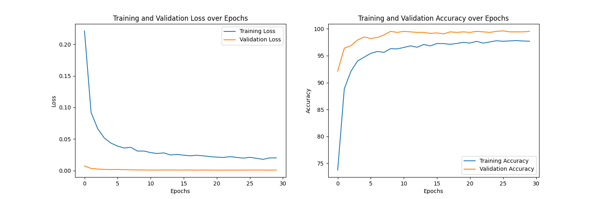

# MRI Brain Tumor Detection Using ResNet-50
## Abstract

This project presents a deep learning-based approach for detecting brain tumors from MRI images. Leveraging the ResNet-50 architecture, the model achieves a high classification accuracy of **99.05% on the training dataset**. The methodology includes data preprocessing, augmentation, and transfer learning, followed by rigorous evaluation on validation and test datasets. The results demonstrate the model's potential for assisting medical professionals in diagnosing brain tumors efficiently.

## 1. Introduction

Brain tumors are life-threatening conditions that require early and accurate diagnosis. Magnetic Resonance Imaging (MRI) is a widely used imaging technique for detecting abnormalities in the brain. However, manual analysis of MRI scans is time-consuming and prone to human error. This project aims to automate the detection of brain tumors using a deep learning model, specifically ResNet-50, to classify MRI images into tumor and non-tumor categories.

## 2. Methodology
### 2.1 Dataset

The dataset used in this project is the [Brain Tumor MRI Dataset](https://www.kaggle.com/datasets/masoudnickparvar/brain-tumor-mri-dataset). It contains MRI images categorized into tumor and non-tumor classes. The dataset was split into training (70%), validation (15%), and test (15%) subsets.

### 2.2 Data Preprocessing

* **Normalization**: Images were normalized to have a mean of `[0.485, 0.456, 0.406]` and a standard deviation of `[0.229, 0.224, 0.225]`.
* **Resizing**: All images were resized to `224x224` pixels to match the input size of ResNet-50.

### 2.3 Data Augmentation

To improve generalization, the training data was augmented using techniques such as random cropping, horizontal flipping, rotation, color jittering, and perspective transformations.

### 2.4 Model Architecture

The ResNet-50 model, pre-trained on ImageNet, was fine-tuned for this classification task. The fully connected layer was replaced with a linear layer having output dimensions equal to the number of classes in the dataset.

### 2.5 Training

The model was trained using the following hyperparameters:
* Learning Rate: $1e-3$
* Momentum: $0.9$
* Weight Decay: $1e-4$
* Batch Size: $32$
* Epochs: $50$
* Optimizer: Stochastic Gradient Descent (SGD)
* Scheduler: StepLR with a step size of $10$ and gamma of $0.5$
The loss function used was CrossEntropyLoss.

## 3. Results and Evaluation
### 3.1 Training and Validation Performance

The model achieved an accuracy of **99.05% on the training dataset**. The validation accuracy and loss were monitored to ensure the model's generalization capability. Below are the graphs illustrating the training and validation accuracy and loss over epochs:
**Training and Validation Loss and Accuracy over Time**

### 3.2 Test Performance

The model was evaluated on the test dataset, achieving high accuracy and low loss, demonstrating its robustness and reliability.

## 4. Conclusion

This project successfully demonstrates the application of deep learning for brain tumor detection using MRI images. The ResNet-50 model, fine-tuned on the dataset, achieved remarkable accuracy, making it a promising tool for assisting in medical diagnoses. Future work could involve testing the model on larger and more diverse datasets, as well as deploying it in real-world clinical settings.

## 5. References

1. K. He, X. Zhang, S. Ren and J. Sun, "Deep Residual Learning for Image Recognition," 2016 IEEE Conference on Computer Vision and Pattern Recognition (CVPR), Las Vegas, NV, USA, 2016, pp. 770-778, doi: 10.1109/CVPR.2016.90.
2. Dataset: [Brain Tumor MRI Dataset](https://www.kaggle.com/datasets/masoudnickparvar/brain-tumor-mri-dataset).

## 6. How to Run the Project

1. Clone the repository and navigate to the project directory.
2. Install the required dependencies using `pip install -r requirements.txt`.
3. Run the Jupyter Notebook [`tumorDetection.ipynb`](tumorDetection.ipynb) to train, evaluate and save the model.
